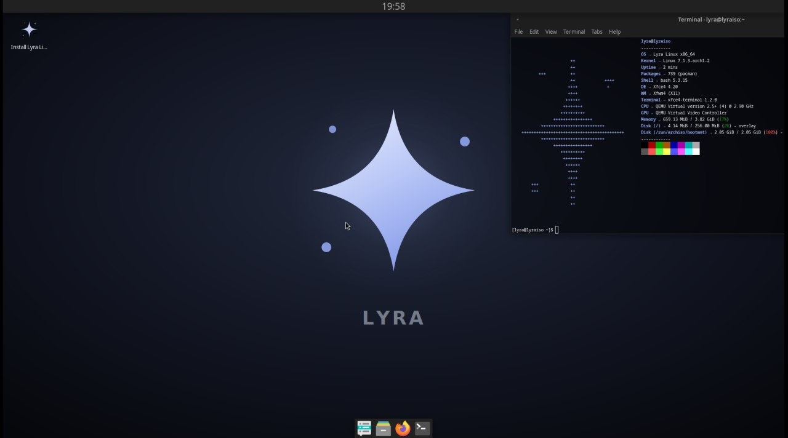

<div align="center">


# Lyra Linux

**An Arch-based rolling distribution for systems developers.**

[](https://github.com/CzarOfDev/LyraLinux/releases)
[](https://archlinux.org)
[](https://xfce.org)

</div>

---

## What is Lyra

Lyra is a live + installable Linux distribution built on Arch. It ships with a
development toolchain out of the box, so you can boot the USB stick and start
compiling, debugging, or tracing syscalls without installing anything first.

No bloat, no telemetry, no vendor lock-in. Just Arch with sane defaults and a
desktop that stays out of your way.

## Screenshot

<div align="center">

</div>

## Features

- **Live mode** — boot from USB, use it as a rescue disk or a portable workstation
- **Graphical installer** — Calamares with disk partitioning, encryption and LVM support
- **Dev toolchain preinstalled** — `gcc`, `gdb`, `clang`, `cmake`, `strace`, `ltrace`, `neovim`
- **Clean install** — live-only cruft (autologin, passwordless sudo, VM guest agents) is
  stripped from the target system automatically
- **XFCE desktop** — lightweight, themed, no surprises
- **Rolling release** — Arch repositories, always current

## Download

Grab the ISO from the [releases page](https://github.com/CzarOfDev/LyraLinux/releases).

Verify the checksum before writing it to a USB stick:

```bash
sha256sum -c lyra-1.0-x86_64.iso.sha256
```

Write it to a drive (replace `/dev/sdX` with your device — **this erases it**):

```bash
sudo dd if=lyra-1.0-x86_64.iso of=/dev/sdX bs=4M status=progress oflag=sync
```

## Requirements

| | Minimum | Recommended |
|---|---|---|
| RAM | 2 GB | 4 GB |
| Disk | 20 GB | 40 GB |
| Boot | BIOS or UEFI | UEFI |
| CPU | x86_64 | x86_64 |

## Building from source

Lyra is built with [`archiso`](https://wiki.archlinux.org/title/Archiso). You need an
Arch-based host.

```bash
sudo pacman -S archiso git

git clone https://github.com/CzarOfDev/LyraLinux.git
cd LyraLinux
```

Calamares is not in the official Arch repositories, so it has to be built from the AUR
and placed in a local repository first:

```bash
git clone https://aur.archlinux.org/calamares.git /tmp/calamares
cd /tmp/calamares
extra-x86_64-build          # builds in a clean chroot

sudo mkdir -p /var/cache/lyra-repo
sudo cp *.pkg.tar.zst /var/cache/lyra-repo/
cd /var/cache/lyra-repo
sudo repo-add lyra.db.tar.gz *.pkg.tar.zst
```

The profile's `pacman.conf` already points at `file:///var/cache/lyra-repo`.

Now build the ISO:

```bash
cd ~/LyraLinux
sudo mkarchiso -v -w /tmp/lyra-work -o ./out ./iso
```

The result lands in `out/lyra-1.0-x86_64.iso`. A full build takes 15–30 minutes and
needs roughly 15 GB of free space in the work directory.

### Testing in QEMU

```bash
qemu-img create -f qcow2 /tmp/lyra-test.qcow2 20G

qemu-system-x86_64 -enable-kvm -m 4G -smp 4 \
  -drive file=/tmp/lyra-test.qcow2,format=qcow2 \
  -cdrom out/lyra-1.0-x86_64.iso -boot d
```

For UEFI, add `-bios /usr/share/edk2/x64/OVMF.4m.fd`.

## Project structure

```
LyraLinux/
├── iso/                              archiso profile
│   ├── packages.x86_64               package list
│   ├── profiledef.sh                 ISO metadata, file permissions
│   ├── pacman.conf                   repositories used during build
│   ├── syslinux/                     BIOS bootloader (menu + splash)
│   ├── efiboot/                      UEFI bootloader (systemd-boot)
│   └── airootfs/                     files copied into the live root
│       ├── root/customize_airootfs.sh    runs inside the chroot at build time
│       ├── etc/calamares/            installer configuration
│       ├── etc/skel/                 default user config (theme, panels, fastfetch)
│       └── usr/share/                logos, wallpaper, ASCII art
└── branding/                         SVG sources for logos and wallpaper
```

## How the installer works

Calamares copies the live filesystem to disk, which means everything from the live
session comes along — including things that must not survive. Two modules handle that:

- `shellprocess@copykernel` + `shellprocess@fixinitcpio` — archiso keeps the kernel
  outside the squashfs image and ships its own mkinitcpio preset, so both are fixed
  before the initramfs is generated
- `shellprocess@cleanup` + `packages` — removes the live user, disables autologin,
  strips archiso leftovers, and uninstalls Calamares itself and the VM guest agents

The installed system asks for a password on `sudo`, has no autologin, and keeps the
hostname you picked during setup.

## Contributing

Issues and pull requests are welcome. If you hit a bug during installation, attach the
Calamares log:

```bash
pkexec calamares -d 2>&1 | tee /tmp/calamares.log
```

## License

The archiso profile and branding assets in this repository are released under the GPL
License. The packages Lyra ships carry their own licenses.

## Credits

Built on [Arch Linux](https://archlinux.org) with [archiso](https://gitlab.archlinux.org/archlinux/archiso).
Installer by [Calamares](https://calamares.io). Desktop by [XFCE](https://xfce.org).
